# 大学4年没讲明白的概率论，被一段 PyTorch 代码讲透了

> 大学里的概率论，大概是这样的：老师在黑板上写下一行公式，
> $P(A\mid B)=\dfrac{P(AB)}{P(B)}$，然后开始证明，下课。
> 四年下来，你会背贝叶斯、会算泊松、会做卷积，但你心里始终有个声音：
> **"这玩意儿到底有什么用？"**
>
> 直到有一天，你打开一个训练大模型的项目，发现整座 Transformer
> ——从生成一个字，到强化学习自我提升——**全是概率论**。
> 而且不是抽象的公式，是一行行能跑、能 debug、能可视化的 PyTorch 代码。
>
> 这篇文章，我们就用本项目 [MathGPT](../README.md) 的真实代码，
> 把概率论从"考试科目"还原成"工程直觉"，再一路延伸到**怎么 debug 大模型**、
> **怎么预测微信群消息量**，以及**生活中处处可用的概率思维**。

本文配套的所有图都可以用 `docs/images/prob/` 里的脚本复现。我们由浅入深：

- **第一部分·历史**：概率论 400 年——从赌桌到大模型，它到底在解决什么问题
- **第二部分·分布**：为什么偏偏是高斯分布唱主角？
- **第三部分·代码**（核心七层，全程用本项目源码）：
  1. softmax：把任意数字变成概率
  2. temperature：同一个分布，不同的"自信程度"
  3. top-k：砍掉概率分布的长尾
  4. 交叉熵：损失函数其实就是"惊讶程度"
  5. 条件概率 → 贝叶斯网络 → 概率图模型 → 因果推断：Transformer 站在阶梯的哪一级
  6. 策略梯度：REINFORCE 用"期望"教模型自我提升
- **第四部分·落地**：debug Transformer / 预测微信泊松流量 / **用贝叶斯信念调试人生、突破难题** / 生活中的概率思维

---

# 第一部分 · 历史：概率论 400 年是怎么一步步走到大模型的

要真正"讲明白"概率论，得先知道它每一步**在解决什么现实问题**。
概率论不是一开始就长这样的，它是被一个个具体问题逼出来的。
下面这条时间线，恰好也是一条"通往大模型"的路：

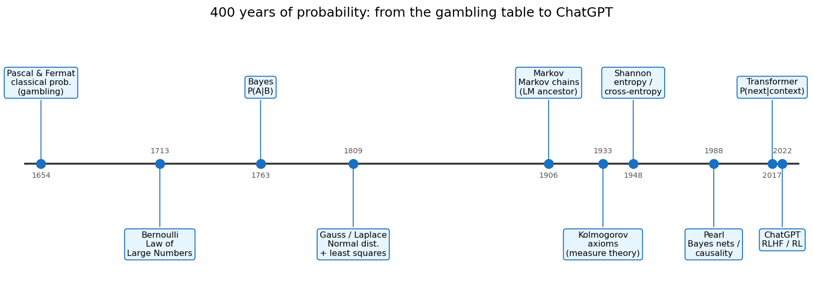

**① 1654，赌桌：古典概率（Pascal & Fermat）。**
起点很接地气：两个赌徒中途散场，赌注怎么分才公平？
Pascal 和 Fermat 通信解决了这个"分赌注问题"，定义了**古典概率**——
等可能事件下，概率 = 有利结果数 / 总结果数。**概率论生于赌博，不是生于课堂。**

**② 1713，从一次到无穷：大数定律（Bernoulli）。**
雅各布·伯努利问：抛硬币次数越多，正面比例真的会趋近 1/2 吗？
**大数定律**给了"频率→概率"的桥。这是第 6 节 RL 里 `pass@k` 评估、
"采样足够多次取平均"之所以可靠的根基。

**③ 1763，逆问题：贝叶斯定理（Bayes）。**
前面都在算"已知原因，求结果的概率"。Bayes 反过来问：
**"看到了结果，怎么反推原因的概率？"** 这就是 $P(\text{原因}\mid\text{证据})$，
后面第 5 节、第 7 节会反复用到。它是"从数据中学习"的最早数学形式。

**④ 1809，连续世界：正态分布登场（Gauss & Laplace）。**
高斯研究天文观测误差时，导出了那条钟形曲线，并配上**最小二乘法**；
拉普拉斯用**中心极限定理**给了它普适性的解释。从此连续随机量有了"默认分布"。
为什么偏偏是它统治了世界？这是下一部分要专门回答的问题。

**⑤ 1906，给随机性装上"记忆"：马尔可夫链（Markov）。**
马尔可夫提出："下一个状态只依赖当前状态"。他当年是拿**俄语文本里的字母转移**做的实验——
**这是语言模型最早的祖先。** n-gram、隐马尔可夫模型，一路到神经语言模型，
本质都在估计"给定上文，下一个符号的概率"。第 5 节会看到 Transformer 正是它的现代化身。

**⑥ 1933，地基浇筑：公理化（Kolmogorov）。**
在此之前概率论一直有点"民科"，靠直觉。柯尔莫哥洛夫用**测度论**把概率建立在三条公理上，
概率论才成为严格的现代数学。今天你写的每一个 `softmax`、每一次期望，背后都站着这套公理。

**⑦ 1948，信息即概率：信息论（Shannon）。**
香农用概率定义了**信息熵** $H=-\sum p\log p$，以及**交叉熵**。
这一步直接连到第 4 节——**大模型的损失函数 `F.cross_entropy` 就是香农 1948 年的发明。**
训练模型"减少惊讶"，用的正是信息论的语言。

**⑧ 1988，相关之上：贝叶斯网络与因果（Pearl）。**
珀尔用**有向无环图（DAG）**把一堆条件概率组织成贝叶斯网络，
后来又开创**因果推断**，区分"相关"与"因果"。第 5 节会讲：
**今天的大模型恰恰卡在他这套阶梯的最底层。**

**⑨ 2017 → 2022，集大成：Transformer 与 RLHF。**
Transformer 把"给定上文预测下一个 token 的条件概率"做到极致（第 5 节）；
RLHF/RL 用策略梯度让模型对齐人类偏好（第 6 节）。
**ChatGPT 不是凭空出现的，它是这条 400 年概率长河的入海口。**

> 🧭 **一句话串联**：赌桌（古典概率）→ 抛硬币（大数定律）→ 反推原因（贝叶斯）→
> 误差曲线（高斯）→ 文本转移（马尔可夫）→ 公理化（柯尔莫哥洛夫）→ 惊讶度（香农熵）→
> 因果图（珀尔）→ 下一个 token（Transformer）→ 自我提升（RL）。
> **每一段，下面都有一段能跑的 PyTorch 代码与之对应。**

---

# 第二部分 · 为什么偏偏是高斯分布唱主角？

学概率时一个常见困惑：分布那么多——均匀、泊松、指数、伯努利、幂律……
**为什么教科书和工程实践里，正态（高斯）分布的戏份远超其他？** 有四个层层递进的理由。

### 理由一：中心极限定理——"大量微小因素之和"必然是高斯

这是最深刻的理由。**中心极限定理 (CLT)**：无论原始变量服从什么分布，
只要把足够多个**独立**随机量加起来（或取平均），结果的分布都会趋近正态。

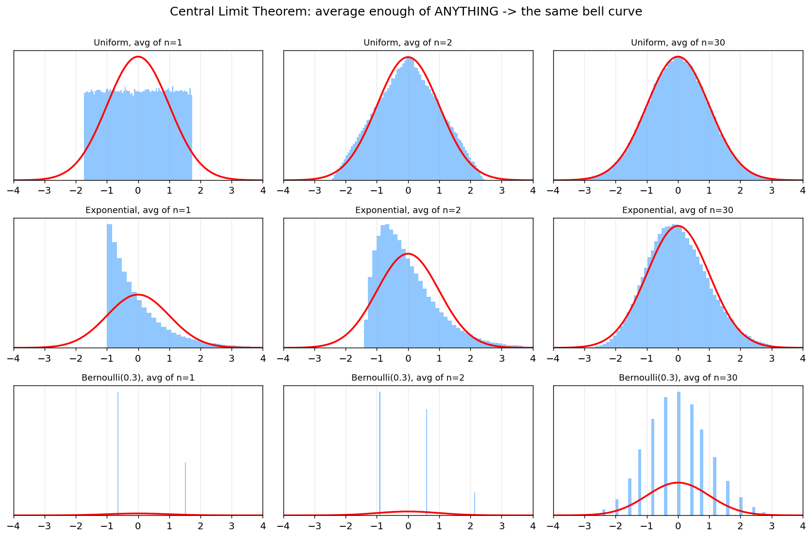

上图三行用了三种完全不同的源分布（均匀、指数、伯努利），
每行从左到右是"对 n 个样本取平均"：**n=1 时奇形怪状，n=30 时全部收敛到同一条红色钟形曲线。**

现实世界里，一个量往往是无数微小独立因素叠加的结果：
身高（成千上万个基因 + 营养 + ……）、测量误差、股价波动、神经元输入之和……
**它们"天然就是高斯的"，不是人为假设，而是 CLT 的必然结论。** 这就是高斯无处不在的根本原因。

### 理由二：最大熵——"承认自己只知道均值和方差"时最诚实的选择

信息论给了第二个理由（呼应第 7 节香农）：
**在只知道一个分布的均值和方差、其余一无所知的前提下，正态分布是熵最大的分布。**

"熵最大"意味着"假设最少、最不自作主张"。
所以当你对一个连续量只有"中心在哪、波动多大"的信息时，
**假设它是高斯，是最不引入额外偏见的选择。** 这让高斯成为默认的、最保守的建模起点。

### 理由三：数学上太好用——自共轭、线性封闭、解析可解

- 两个高斯相加还是高斯；高斯做线性变换还是高斯。
- 高斯的**共轭先验**还是高斯——贝叶斯更新有闭式解，不用数值积分。
- 只需**均值 + 协方差**两个量就完全确定，最优估计退化成熟悉的最小二乘（高斯 1809 的原配）。

工程上，"能算出解析解"往往压倒一切，这让高斯成为算法设计的宠儿。

### 理由四：在深度学习里，高斯其实无处不在

回到本项目这类大模型，高斯藏在很多地方：

- **权重初始化**：Xavier / Kaiming 初始化都是从高斯（或其变体）采样，让信号方差逐层稳定。
- **梯度噪声**：SGD 的小批量梯度噪声近似高斯（又是 CLT），这是理解优化的关键。
- **扩散模型**：整个生成范式就是"逐步加高斯噪声再学着去噪"。
- **VAE / 隐变量**：隐空间先验通常设为标准正态。

> ⚠️ **但要诚实：大模型的"输出"恰恰不是高斯！**
> 语言模型预测下一个 token，用的是**离散的类别分布（categorical / 多项式分布）**——
> 也就是第 1 节的 `softmax`，而非高斯。词频还服从**幂律/长尾**（Zipf 定律），
> 这也是第 3 节要用 `top-k` 砍长尾的原因。
> **所以正确的认知是**：高斯统治"连续、对称、多因素叠加"的世界（参数、噪声、误差），
> 而离散选择的世界由 categorical 分布统治。**选对分布，是概率建模的第一步功夫。**

> 🔑 **概率思维落地 #0**：看到一个量，先问"它是怎么生成的？"
> 是"很多小因素叠加"（→ 高斯）？是"单位时间随机计数"（→ 泊松，第 7 节）？
> 还是"从有限选项里挑一个"（→ categorical，第 1 节）？
> **建模选错分布，后面再精巧的计算都是错的。**

---

# 第三部分 · 代码：七层拆透大模型里的概率论

## 0. 一个被忽略的真相：神经网络的输出从来不是答案，是分布

先记住一句话，它是后面所有内容的地基：

> **语言模型每走一步，吐出来的不是"下一个字"，而是"整个词表上的一个概率分布"。**

在本项目里，模型最后一层就是把隐藏向量投影成 `vocab_size` 个数（叫 **logits**）：

```python
# nanochat/gpt.py  (forward)
logits = self.lm_head(x)                     # (B, T, vocab_size) 每个 token 一个分数
logits = logits[..., :self.config.vocab_size]
logits = logits.float()
softcap = 15
logits = softcap * torch.tanh(logits / softcap)  # 把 logits 平滑压到 [-15, 15]
```

注意：这时候 `logits` 还只是一堆任意实数，可能是 `8.0, 6.5, -3.2, ...`。
它**不是概率**——没有非负、不归一、加起来也不等于 1。

把它变成概率，只需要一个函数：**softmax**。这就是第一层。

---

## 1. softmax：把任意数字变成"概率"

概率分布必须满足两条：每一项 ≥ 0，所有项加起来 = 1。
softmax 用一招同时搞定：先 `exp`（保证为正），再除以总和（保证归一）：

$$
p_i = \frac{e^{z_i}}{\sum_j e^{z_j}}
$$

本项目里它就藏在采样函数里：

```python
# nanochat/engine.py  sample_next_token()
probs  = F.softmax(vals, dim=-1)                       # logits -> 概率分布
choice = torch.multinomial(probs, num_samples=1, generator=rng)  # 按概率抽一个
```

这两行就是大模型"写字"的核心：
**softmax 把分数变成概率，`multinomial` 按这个概率掷一次骰子。**

大学里 softmax 通常只在"逻辑回归"那一节露个脸，老师不会告诉你：
**你每天用的 ChatGPT，每吐一个字，背后都在做一次 softmax + 掷骰子。**

> 🔑 **概率思维落地 #1**：softmax 不只是公式，它是"**把直觉打分变成可比较的概率**"的通用工具。
> 你给三家公司 offer 打分 `8 / 6.5 / 5`？做个 softmax，你就知道"如果让你随机选，你有多大概率去第一家"。
> 分差越大越笃定，分差越小越纠结——而这个"纠结程度"，下一节就能量化。

---

## 2. temperature：同一个分布，不同的"自信程度"

注意上面代码里有一行 `vals = vals / temperature`。这个 `temperature`（温度）
是理解概率分布"形状"的最好教具。它不改变谁排第一，只改变**分布有多尖**：

```python
# nanochat/engine.py
if temperature == 0.0:
    return torch.argmax(logits, dim=-1, keepdim=True)  # T=0：永远选最大，完全确定
...
vals  = vals / temperature   # T<1 放大差距(更自信)，T>1 抹平差距(更随机)
probs = F.softmax(vals, dim=-1)
```

同样的 logits `[8.0, 6.5, 5.0, ...]`，在不同温度下变成完全不同的分布：

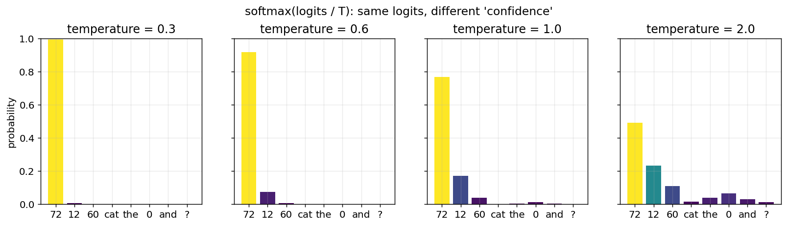

- **T=0.3**：几乎 100% 选 "72"，模型"斩钉截铁"。
- **T=1.0**：第一名约 77%，但偶尔会选别的，有了"创造性"。
- **T=2.0**：分布被抹平，第一名只剩 ~49%，模型开始"胡言乱语"。

本项目推理默认 `temperature=0.6`（见 README 参数表）——
**比 1 略冷，保证数学题答案稳定，又不至于死板。**

> 🔑 **概率思维落地 #2**：temperature 就是"**我有多确定**"的旋钮。
> 做选择时，"高温"是头脑风暴（多探索几个方案），"低温"是拍板执行（选最优）。
> 调试模型答非所问时，第一反应应该是：**温度是不是太高了？**

---

## 3. top-k：砍掉概率分布的长尾

词表有三万多个 token，softmax 之后，绝大多数 token 都有一点点（非零的）概率。
如果完全按这个分布抽样，偶尔会抽到一个排名第 8000、概率 0.0001 的"垃圾词"，
答案就崩了。**top-k 采样**：只保留概率最高的 k 个，其余全部置零再重新归一化。

```python
# nanochat/engine.py  sample_next_token()
if top_k is not None and top_k > 0:
    k = min(top_k, logits.size(-1))
    vals, idx = torch.topk(logits, k, dim=-1)   # 只留前 k 名
    vals  = vals / temperature
    probs = F.softmax(vals, dim=-1)             # 在这 k 个里重新分配 100% 概率
    choice = torch.multinomial(probs, num_samples=1, generator=rng)
    return idx.gather(1, choice)
```

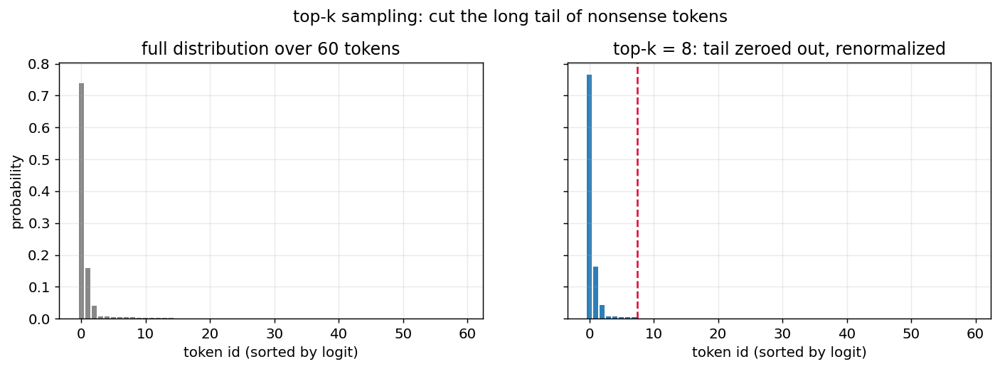

左边是完整分布（长尾里全是噪声），右边是 `top-k=8` 之后：红线右边的尾巴被一刀切掉，
概率质量重新集中到靠谱的候选上。本项目默认 `top_k=50`。

> 🔑 **概率思维落地 #3**：top-k 是"**只在靠谱的选项里随机**"。
> 选餐厅别在全城 5000 家里随机，先按评分取 top 10，再随便挑一家——
> 既保留惊喜，又避免踩雷。这就是 top-k 的人生版。

---

## 4. 交叉熵：损失函数其实就是"惊讶程度"

前面讲的是"模型怎么用概率生成"。现在反过来问：**模型怎么学？**

预训练的目标只有一句话：**让正确的下一个字，获得尽可能高的概率。**
怎么把"概率高不高"变成一个能优化的数字？答案是**交叉熵 = 负对数似然**：

$$
\text{loss} = -\log p(\text{正确的下一个字})
$$

本项目里就是一行：

```python
# nanochat/gpt.py  forward()
loss = F.cross_entropy(
    logits.view(-1, logits.size(-1)),
    targets.view(-1),
    ignore_index=-1,        # -1 的位置不计损失（比如 prompt 部分）
    reduction=loss_reduction,
)
```

为什么是 `-log(p)`？看这条曲线就懂了：

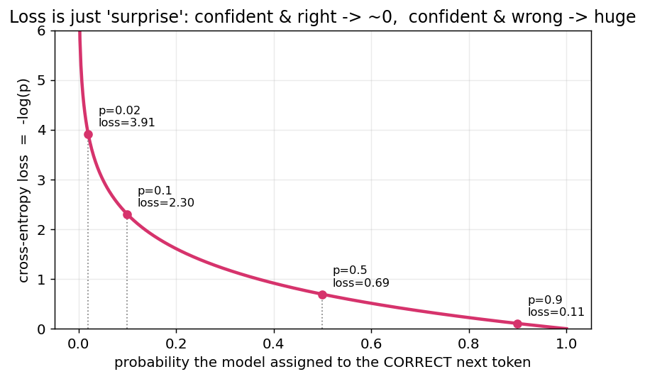

- 模型给正确答案 `p=0.9` → loss ≈ 0.1（"我早就知道"，几乎不惊讶，几乎不罚）
- 给 `p=0.5` → loss ≈ 0.69（"半信半疑"）
- 给 `p=0.02` → loss ≈ 3.9（"竟然是这个？！"，巨大的惊讶，巨大的惩罚）

**训练，就是不断减少模型对真实世界的"惊讶程度"。**
这就是为什么交叉熵也叫"困惑度"（perplexity）的来源——困惑越少，模型越懂世界。

大学里"最大似然估计 (MLE)"和"交叉熵"是两章分开讲的，
你可能从没意识到：**最小化交叉熵 ≡ 最大化似然 ≡ 让训练数据在模型眼里最不意外。**
三个名字，一件事。

> 🔑 **概率思维落地 #4**：用"惊讶程度"评估你的判断质量。
> 你预测某事 90% 会发生，结果没发生 → 你应该非常惊讶，并大幅修正认知（大 loss）。
> 你说 50% → 无论结果如何都别太得意（中等 loss）。
> **一个好的预测者，是长期"惊讶总量"最小的人。** 这正是 cross-entropy 在做的事。

---

## 5. 条件概率 → 贝叶斯网络 → 因果推断：Transformer 站在阶梯哪一级

现在我们触到了那张被反复念叨、却从没真正"用过"的公式：**条件概率 $P(A\mid B)$。**
这一节会从它出发，一路爬到贝叶斯网络、再到因果推断——
并回答一个尖锐的问题：**为什么再大的大模型，也会一本正经地胡说八道？**

大学里它是个抽奖、摸球的玩具。但在大模型里，它是**全部**。
一句话的概率，被链式法则拆成一连串条件概率的乘积：

$$
P(w_1 w_2 \cdots w_n) = \prod_{t=1}^{n} P(w_t \mid w_1, \dots, w_{t-1})
$$

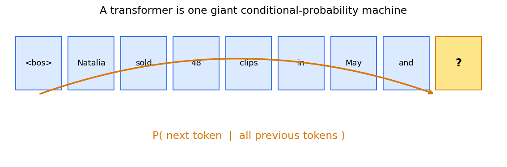

模型每一步算的，就是 **"给定前面所有字，下一个字是什么"** 的条件分布。
在代码里，这个"给定前面所有字"是靠 **KV Cache** 实现的——
它把"历史"（条件 $B$）缓存下来，新 token 只需在这个条件下计算：

```python
# nanochat/engine.py  generate()
# 把已经算过的 K/V（也就是"条件"，前文上下文）缓存起来
logits = self.model.forward(ids, kv_cache=kv_cache_decode)[:, -1, :]
# 在"给定前文"的条件下，对下一个 token 采样
next_ids = sample_next_token(logits, rng, temperature, top_k)
```

`[:, -1, :]` 这个切片很关键：我们只取**最后一个位置**的 logits，
因为我们要的就是 $P(\text{next}\mid \text{前面全部})$。

**这就是"GPT"里的 G（Generative）和 P（Pre-trained）背后的概率内核。**
你大学里背的链式法则 $P(ABC)=P(A)P(B\mid A)P(C\mid AB)$，
正是 ChatGPT 写出每一句话的方式。

### 条件概率，还藏在工具调用里

本项目的模型会算数学题时调用计算器，这本身就是一个**条件概率的状态机**：
当模型采样出 `<|python_start|>`，后续 token 的分布就被"条件化"到了写表达式的模式：

```python
# nanochat/engine.py  generate()  —— 工具调用状态机
if next_token == python_start:
    state.in_python_block = True            # 进入"写代码"的条件
elif next_token == python_end and state.in_python_block:
    expr   = self.tokenizer.decode(state.python_expr_tokens)
    result = use_calculator(expr)           # 算出真实结果
    if result is not None:
        state.forced_tokens.append(output_start)
        state.forced_tokens.extend(self.tokenizer.encode(str(result)))
        state.forced_tokens.append(output_end)  # 强制把结果"喂"回上下文
```

被 `use_calculator` 算出的真实结果会作为**新的条件**注入上下文，
后面所有 token 都在"已知 12×6=72"的条件下生成——
**这就是检索增强 (RAG)、工具调用的概率本质：不断给条件概率添加新的、可靠的条件。**

### 5.1 往上一层：贝叶斯网络——把"一堆条件概率"组织成一张图

链式法则 $P(w_1\cdots w_n)=\prod_t P(w_t\mid w_{<t})$ 有个麻烦：
**条件越来越长，联合分布的参数量是指数爆炸的。** 如果什么都依赖什么，根本算不动。

珀尔 1988 年的解法是**贝叶斯网络**：用一张**有向无环图 (DAG)** 画出"谁直接依赖谁"，
**没有连线就代表条件独立**，于是巨大的联合分布被分解成一串"小条件概率"的乘积。

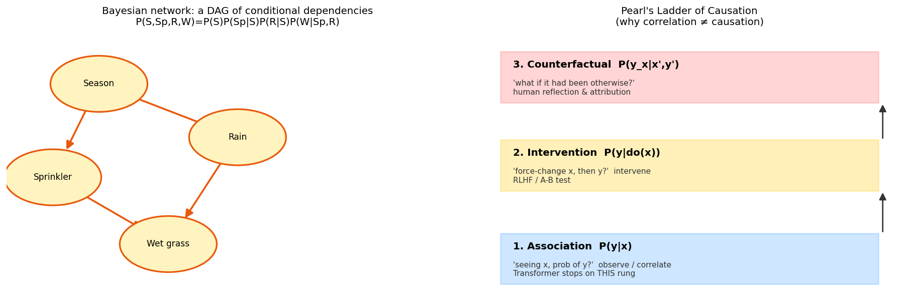

左图是经典例子：季节影响"是否开洒水器"和"是否下雨"，两者又共同决定"草地是否湿"。
原本要描述 4 个变量的联合分布，借助这张图只需几个局部条件概率：

$$
P(S, Sp, R, W) = P(S)\,P(Sp\mid S)\,P(R\mid S)\,P(W\mid Sp, R)
$$

**这正是 Transformer 在做的事的"显式版本"：**
注意力机制可以看作模型在**自动学习** token 之间"谁依赖谁"的稀疏图结构——
贝叶斯网络是人手画依赖图，Transformer 是用数据把这张图学出来。两者同源。

贝叶斯网络也让"贝叶斯定理"真正活了起来：观测到"草地湿了"，
可以**反向推断**"多半是下雨了还是开了洒水器"——这就是 $P(\text{原因}\mid\text{证据})$，
诊断、归因、推理，全靠它。

### 5.2 再往上：因果推断——为什么"相关"喂不出"因果"

但贝叶斯网络（以及 Transformer）有个天花板。珀尔提出了著名的**因果阶梯**（上图右）：

| 层级 | 问的问题 | 数学 | 谁在这一层 |
|------|---------|------|-----------|
| ① 关联 | "看到 X，Y 的概率？" | $P(Y\mid X)$ | **大模型停在这里** |
| ② 干预 | "我**强行**改变 X，Y 会怎样？" | $P(Y\mid do(X))$ | A/B 实验、RLHF |
| ③ 反事实 | "如果当初没那样，结果会不同吗？" | $P(Y_x\mid X',Y')$ | 人类的反思、追责 |

关键在第①和第②层的鸿沟。经典例子："冰淇淋销量"和"溺水人数"高度**相关**——
但不是冰淇淋导致溺水，而是"夏天"这个共同原因。
**只看 $P(Y\mid X)$ 的模型会学到这种伪相关，而 $P(Y\mid do(X))$（真去禁售冰淇淋）才能区分真假因果。**

> 🧨 **这解释了大模型为什么会"幻觉"**：Transformer 训练目标 $P(\text{next}\mid\text{context})$
> 纯粹是第①层的**关联**。它学的是"这些词经常一起出现"，**而非"谁导致谁"**。
> 所以它能流畅地把常见搭配缝在一起，却可能缝出一个事实上错误、因果上荒谬的句子。
> **大模型的"一本正经胡说八道"，本质是停留在因果阶梯最底层的必然代价。**

那本项目的 RL（第 6 节）是什么？**它正是往第②层"干预"爬的一小步：**
不再被动模仿语料，而是**主动采样、真去验证答案对错、再据此调整概率**——
这已经带有"干预并观察后果"的因果味道。这也是为什么 RLHF/RL 对"让模型更可靠"如此关键。

### 5.3 概率图模型 (PGM)：贝叶斯网络只是这张大地图的一角

退一步看全景：**贝叶斯网络属于一个更大的家族——概率图模型 (Probabilistic Graphical Models)。**
一句话定义：**用"图"来表示一堆随机变量之间的依赖关系，从而把庞大的联合分布拆成可计算的小块。**
按"图怎么画"，它分成几支，而本文前面出现的概念几乎都能在这张地图上找到坐标：

| 概率图模型 | 图的形式 | 表示什么 | 本文/本项目里的对应 |
|-----------|---------|---------|-------------------|
| 贝叶斯网络 | 有向无环图 | 因果/生成方向的条件依赖 | 5.1 节、注意力学到的依赖 |
| 马尔可夫随机场 / CRF | 无向图 | 对称的相互影响（无方向） | 图像分割、序列标注 |
| 马尔可夫链 / HMM | 链式展开 | 时序：下一状态依赖当前 | 历史第⑤步，n-gram 语言模型 |
| **Transformer** | 学出来的动态全连接图 | 每个 token 对其他 token 的注意力权重 | **本项目 `gpt.py` 的注意力** |

所以"GPT 是什么"可以有个更本质的回答：
**它是一个把依赖图从'人手画'升级为'用数据自动学'的概率图模型。**
马尔可夫链假设"只看前一个词"（一阶依赖），n-gram 看前 n 个，
而 Transformer 的注意力**让每个位置自己决定该依赖前文的哪些词、依赖多重**——
这张图不再是固定的，而是随输入动态生成的。这就是它碾压前辈的根本原因。

> 概率图模型给了我们一副统一的眼镜：**马尔可夫链、HMM、贝叶斯网络、CRF、乃至 Transformer，
> 都是"在图上做概率推断"。** 你大学里割裂学的这些章节，其实是同一棵树上的不同枝杈。

> 🔑 **概率思维落地 #5（这条最值钱）**：条件概率是"**新信息如何改变你的判断**"。
> - "这个项目能成吗？" → 无条件，瞎猜。
> - "已知团队做过三个同类项目、且拿到了头部客户，这个项目能成吗？" → 条件概率，靠谱多了。
>
> 生活里每一条新信息，都是在给你的判断"加一个条件"。
> 学会问 **"在已知 X 的条件下"**，你就掌握了概率论里唯一真正改变命运的那个公式。
>
> 🪜 **再往上一层（因果阶梯）**：别停在"A 和 B 总一起出现"（关联）。
> 多问一句"如果我**真去改变 A**，B 会变吗？"（干预），以及"当初要是没做 A，结果会不同吗？"（反事实）。
> "努力和成功相关" ≠ "努力导致成功"——分清这两者，你就比只会拟合相关性的大模型站高了两级。

---

## 6. 策略梯度：用"期望"教模型自我提升

最后一层，也是本项目的灵魂：**强化学习 (RL)**。这里概率论从"描述世界"升级为"改变世界"。

预训练让模型学会"像人一样说话"，但说得对不对，没人管。
RL 阶段，我们让模型**对同一道数学题采样多个答案，对的奖励 1，错的奖励 0**，
然后调整概率分布：**让"答对的路径"概率上升，"答错的路径"概率下降。**

```python
# scripts/train_rl.py  get_batch()
# 1) 对同一道题采样 num_samples 个答案（每个都是一次随机游走）
seqs_batch, _ = engine.generate_batch(tokens, num_samples=args.device_batch_size,
                                       temperature=args.temperature, top_k=args.top_k, ...)
# 2) 给每个答案打分：对=1.0, 错=0.0
rewards = [train_task.reward(conversation, tokenizer.decode(s[prefix_length:]))
           for s in generated_seqs]
# 3) 优势 = 奖励 - 平均奖励（这一步是 REINFORCE 的精髓）
rewards    = torch.tensor(rewards, dtype=torch.float, device=device)
advantages = rewards - rewards.mean()
```

为什么要减去平均值 `rewards.mean()`？这就是大学里**期望 $E[X]$** 真正的用武之地：

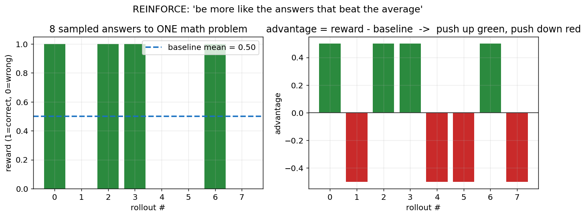

把平均奖励当作"基准线 (baseline)"，**比平均好的答案优势为正（往上推），比平均差的为负（往下压）**。
这正是"相对于期望的偏离"——你大学里学的方差、期望，在这里变成了"教模型变聪明"的方向盘。

更新的目标函数，就是大学概率论里那个 $E[f(X)]$ 的策略梯度版：

```python
# scripts/train_rl.py  训练循环
# 策略梯度目标：最大化 E[logp * advantage]
logp   = -model(inputs, targets, loss_reduction='none').view_as(inputs)  # 每个 token 的对数概率
pg_obj = (logp * advantages.unsqueeze(-1)).sum()
loss   = -pg_obj
loss.backward()
```

一行 `logp * advantage` 就讲完了 REINFORCE：

> **正确答案里的每个字，提高它的概率；错误答案里的每个字，降低它的概率；
> 提高/降低的力度，正比于这个答案比平均"好/坏"多少。**

这是一个干净的 REINFORCE 实现（见 [README 的 RL 原理](../README.md#rl-训练原理)），
无 KL 正则、无 PPO clipping。整个"大模型对齐"的魔法，剥到底层，
就是大学概率论里的**期望、采样、对数似然**这三件套。

> 🔑 **概率思维落地 #6**：期望思维 = "**不看单次结果，看长期平均**"。
> 一次决策的好坏别用单次结果判断（你可能只是运气好/坏），
> 要问"这个策略重复 1000 次，期望收益是正还是负？"。
> 减 baseline 的智慧是：**别和绝对值较劲，和'平均水平'比**——这才是进步的方向。

---

## 7. 落地三连：debug 大模型 / 预测微信流量 / 生活概率思维

> 学概率，"**用到生活中形成映射反应，才不会被忘掉**"。下面把上面六层接回真实世界。

### 7.1 如何 debug 一个 Transformer：把概率画出来

模型答错了，怎么 debug？传统程序你能打断点看变量，但 Transformer 是概率机器，
**最有效的调试手段是把"概率分布"可视化出来。** 几个实战招式：

**① 画 per-token 熵 (entropy)，找到模型"心虚"的地方。**
熵 $H=-\sum p\log p$ 衡量分布有多"散"。熵高 = 模型很不确定（容易出错的决策点）；
熵≈0 = 模型很笃定（或是被强制注入的工具结果）。

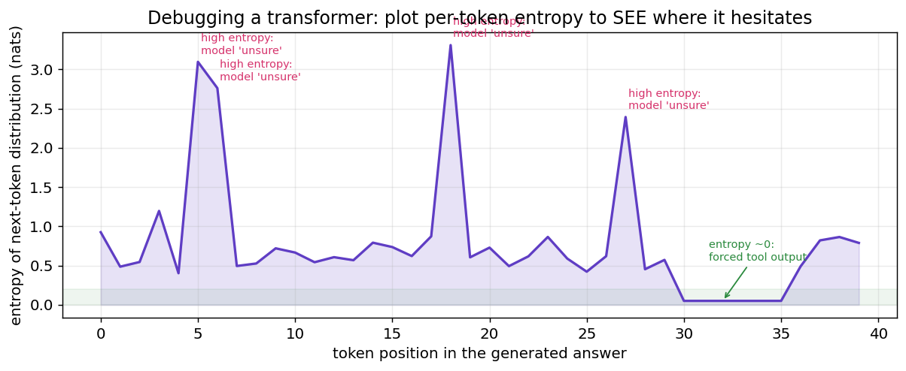

```python
# 调试片段：在 engine.generate 的采样处加几行，记录每步分布的熵
import torch.nn.functional as F
probs   = F.softmax(logits / temperature, dim=-1)
entropy = -(probs * probs.clamp_min(1e-9).log()).sum(-1)   # 每个 token 的熵
# 把 entropy 存下来画成上面那张图：尖峰处就是模型"拿不准"的关键决策点
```

熵的尖峰，往往就是模型推理链断裂、答案开始跑偏的地方——**先去看那里。**

**② 对比 temperature 扫描。** 答案不稳定？把 `temperature` 从 0 扫到 1.5，
看答案在什么温度下开始崩——崩得早说明模型对这道题本就没把握（见第 2 节）。

**③ 看 top-k 候选词。** 把每步的 `torch.topk(logits, 5)` 打印出来，
如果正确答案根本不在前 5，说明问题在**模型能力/训练**，而不是采样策略。

**④ 用 pass@k 量化"运气成分"。** 本项目评估时正是这么做的：

```python
# scripts/train_rl.py  —— pass@k：采样 k 次，至少对一次的比例
for k in range(1, args.device_batch_size + 1):
    passk[k-1] = sum(any(o["is_correct"] for o in r["outcomes"][:k]) for r in records)
```

`pass@1` 低但 `pass@8` 高 → 模型其实"会做"，只是采样没采到（调采样/RL 能救）；
`pass@8` 也低 → 模型是真不会（得加训练数据/调模型）。**这是一条极其重要的诊断分界线。**

### 7.2 预测微信群流量：泊松分布

> "预测微信流量泊松分布"——这是把概率论用回生活最漂亮的例子。

**泊松分布**专门描述"单位时间内，独立随机事件发生的次数"：
群消息数、客服来电数、网站请求数、地铁站到人数……都近似泊松。

$$
P(X=k) = \frac{\lambda^k e^{-\lambda}}{k!}
$$

$\lambda$ 是"平均每小时几条消息"。下图是不同活跃度的群的消息分布：

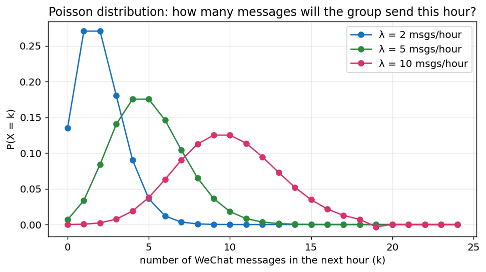

这就是"**概率编程**"最朴素的样子——几行代码就能拟合并预测：

```python
import numpy as np
from scipy import stats

# 过去 7 天，每小时的微信群消息数（你的真实数据）
counts = np.array([3, 5, 2, 8, 6, 4, 7, 5, 9, 1, 4, 6, ...])

lam = counts.mean()                       # 最大似然估计：λ̂ 就是样本均值
print(f"平均每小时 {lam:.1f} 条")

# 预测：下一个小时消息数 ≥ 10 的概率（该不该开免打扰？）
p_busy = 1 - stats.poisson.cdf(9, lam)
print(f"下一小时爆群(≥10条)的概率：{p_busy:.1%}")
```

注意 `lam = counts.mean()`——**泊松的 λ 的最大似然估计就是样本均值**，
和第 4 节"交叉熵 ≡ 最大似然"是同一套思想。概率论的内核，到处都在复用。

更进一步，用概率编程框架（如 PyMC）还能做**贝叶斯估计**，
不仅给出 λ 的点估计，还给出"我对这个 λ 有多确定"的整条后验分布——
这又回到了第 5 节的条件概率：**用观测数据，把先验更新成后验。**

### 7.3 生活中处处的概率思维

把这篇文章的六层，翻译成日常决策的反射动作：

| 概率概念 | 代码里 | 生活里的"映射反应" |
|---------|--------|------------------|
| 高斯 / CLT | 权重初始化、梯度噪声 | "很多小因素叠加"的量默认钟形：身高、误差、波动 |
| softmax | logits → 概率 | 把模糊的"打分/好感"变成可比较的概率 |
| temperature | 控制分布尖锐度 | 探索期调高温（多试），执行期调低温（拍板） |
| top-k | 砍掉长尾 | 只在靠谱的少数选项里随机，别在全集里碰运气 |
| 交叉熵 / 似然 | `-log(p)` | 做长期"惊讶最小"的预测者，错了就大幅修正 |
| **条件概率 / 贝叶斯** | KV Cache / 工具调用 | 永远问"在已知 X 的条件下"，让新证据更新判断 |
| 贝叶斯网络 / PGM | 注意力的依赖结构 | 画清"谁直接影响谁"，别把链条上的远亲当直接原因 |
| **因果阶梯** | RL 的"采样—验证—调整" | 区分相关 / 干预 / 反事实："真去改 A，B 会变吗？" |
| **贝叶斯信念 (Beta)** | RL 多 rollout 采样 | 把"我相信 A 能成"量化成后验，按结果更新、按信念下注 |
| 探索 vs 利用 | temperature / top-k | 突破难题：信念高的多试，也留一点随机探索黑马 |
| 期望 / 优势 | `reward - mean` | 看长期期望而非单次结果，和平均水平比 |
| 泊松 | `λ = mean` | 预测"单位时间内随机事件次数"：排队、消息、故障 |

> "**条件概率就很有用**"——这句大白话其实是整个概率论里最实用的一句。
> 贝叶斯定理 $P(A\mid B)=\dfrac{P(B\mid A)P(A)}{P(B)}$ 不是用来考试的，
> 它是你每次"看到新证据、更新旧看法"时，大脑本该执行的运算。
> 医生看到化验单更新诊断、投资人看到财报更新估值、你看到对方已读不回更新心情——
> **全是条件概率。**

### 7.4 用贝叶斯信念调试人生：程序员的 `jim0 → jim1 → … → jimn`

贝叶斯信念网络听起来很学术，但每个程序员**每天都在用它**，只是没意识到。
想想你死磕一个难 bug 的过程：

> 你有一个能跑的基线版本 `jim0`（committed，✓）。
> 你相信"方向 A 能解决问题"，**相信度大概 0.6**，于是基于 jim0 改出 `jim1` 去试。
> 失败。你**没有放弃**，因为信念还没崩，又改出 `jim2`——又失败。
> 两次失败后，你对方向 A 的信念从 0.6 掉到了 0.35，**于是 `git reset` 退回 jim0**，
> 转去试方向 B。`jim1'` 也失败，但 `jim2'` 出现了转机，信念升到 0.55，
> 顺着改出 `jim3`——**突破了。**

这整个过程，就是一棵**贝叶斯搜索树**：

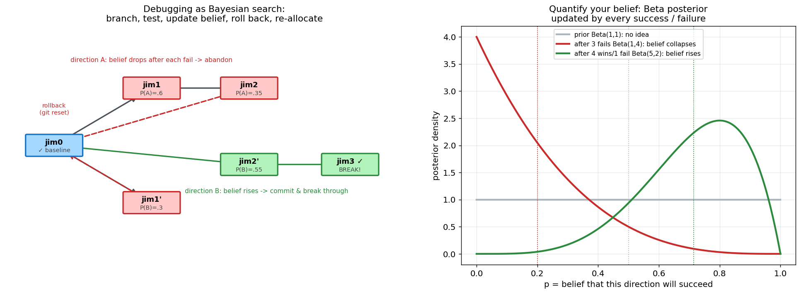

**左图**是版本树：每个节点是一次尝试，绿色成功、红色失败、虚线是回滚 (rollback)。
**右图**回答了那个最关键的问题——"你相信 A 方向能成功，相信度到底是多少？"
答案可以被精确量化：把"方向 A 的成功率"建模成一个 **Beta 分布**（贝叶斯里描述"概率的概率"的标准工具）：

- 一开始什么都不知道 → 先验 `Beta(1,1)`，平的，相信度均值 0.5；
- 失败 3 次 → 后验 `Beta(1,4)`，整条曲线塌向 0，**相信度均值跌到 0.2**（该撤了）；
- 成功 4 次失败 1 次 → 后验 `Beta(5,2)`，曲线涌向右侧，**相信度均值升到 0.71**（该加注）。

```python
# 把"对某个方向的信念"写成几行概率编程
from scipy.stats import beta
alpha, beta_ = 1, 1                      # 先验：毫无信息
for outcome in attempts:                 # 每次尝试的结果
    if outcome == "success": alpha += 1  # 成功 -> 信念右移
    else:                    beta_ += 1  # 失败 -> 信念左移
belief = alpha / (alpha + beta_)         # 当前对"这个方向能成"的相信度
# 决策：belief 跌破阈值就 rollback 换方向，够高就 all-in
```

这正是第 6 节 RL 里 `advantage = reward - mean` 的人生版——
**用结果不断更新信念，把注意力（和时间）重新分配到信念更高的分支上。**

#### 那么，怎么才能突破一个很难的问题？

难题之所以难，是因为**没有任何一个方向的成功信念压倒性地高**。
概率思维给的不是"更努力"，而是一套**探索 vs. 利用 (explore-exploit)** 的策略：

1. **维护多个方向的信念分布**，而不是一条道走到黑（别把全部时间沉没到信念已塌的方向 A）。
2. **按信念分配尝试次数**（Thompson 采样的思想）：从每个方向的 Beta 分布里各抽一个样，
   谁抽得高就试谁——**信念高的多试，但信念低的也偶尔给机会**，避免错杀黑马。
   这跟第 2 节的 `temperature` 是同一个智慧：**留一点随机探索，别过早收敛。**
3. **每次失败都是一次贝叶斯更新，不是白费**：它在帮你把某些方向的后验压低，
   等价于"缩小搜索空间"。爱迪生那句"我没失败，只是找到了一万种行不通的方法"，
   翻译成概率语言就是：**他在对一万个方向做贝叶斯剪枝。**
4. **保留可回滚的 `jim0`**：committed 的基线让你敢于大胆探索高风险分支——
   失败了 `git reset` 就行。**有退路，才敢下注。**

> 🔑 **概率思维落地 #7（突破难题）**：把"我卡住了"重述为"我的信念分布还很平"。
> 然后做三件事：**①量化每个方向的相信度（Beta 后验）；②按信念分配尝试、保留少量随机探索；
> ③每次失败都更新信念、剪掉死方向、退回基线再出发。**
> 这不是鸡汤，这是 RL、是 MCTS、是 A/B 实验、也是这个 MathGPT 项目采样多条 rollout 的同一套数学。

---

## 结语：概率思维，概率编程

回到开头那个问题——大学四年的概率论为什么没讲明白？

因为它把概率教成了"**计算**"：摸球、抽签、求积分。
它把 400 年的思想史压成几个孤立的公式，却没告诉你这条河流向哪里。
而概率真正的样子是"**建模与决策**"：
- **选对分布**来描述不确定的世界（高斯 / 泊松 / categorical——先问"这个量怎么生成的"）；
- 用**数据**去拟合、更新这个分布（最大似然 / 贝叶斯 / 交叉熵）；
- 在分布上做**采样与决策**（temperature / top-k / 期望最大化）；
- 并且永远清醒：自己学到的是**关联**，还是**因果**（珀尔的阶梯）。

这几步，就是这个 MathGPT 项目从预训练、到 SFT、到 RL 的全过程，
也是从赌桌（Pascal）一路到 ChatGPT 的 400 年概率史的全过程，
更是你做每一个理性决策的全过程。**历史、代码、人生，是同一条线。**

> **概率思维，是把"我觉得"换成"有多大概率"；**
> **概率编程，是把这个判断写成几行能跑、能验证、能 debug 的代码。**

当你能在一段 PyTorch 里同时看见 softmax、条件概率、期望和最大似然，
并且能把它们映射回"调温度、减 baseline、预测群消息"这些具体动作时——
概率论才算真正长进了你的直觉里，**再也忘不掉。**

---

### 附：复现本文所有图

本文 11 张图均由 matplotlib 生成，逻辑与本项目代码一致
（历史时间线 / 中心极限定理 / softmax / top-k / 交叉熵 / 条件概率链 / 贝叶斯网络与因果阶梯 /
贝叶斯信念搜索树 / 优势函数 / 泊松 / 熵）。
配套脚本见 `docs/images/prob/` 下的 `make_figs.py`、`make_figs2.py`、`make_figs3.py`，核心数学就是上文每段贴出的那几行。

### 延伸阅读（本项目内）

- [README.md](../README.md) — MathGPT 总览与 RL 训练原理
- [docs/RL_SFT_GRPO_INTRO.md](RL_SFT_GRPO_INTRO.md) — SFT / GRPO / RL 的演进
- [docs/SFT_TO_GRPO_NARRATIVE.md](SFT_TO_GRPO_NARRATIVE.md) — 从 SFT 到 GRPO 的叙事
- 关键源码：`nanochat/engine.py`（采样/工具调用）、`nanochat/gpt.py`（交叉熵）、`scripts/train_rl.py`（策略梯度）
